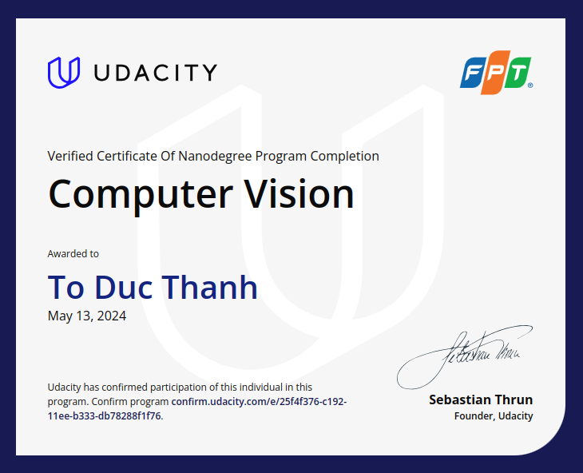

# ComputerVision-udacity

Projects done in Udacity Computer Vision Nanodegree.

- Project 1: [Facical Keypoint Detection](Facial_keypoint_detection)
- Project 2: [Image captioning](Image_captioning)
- Project 3: [SLAM](SLAM)

[Certificate](https://www.udacity.com/certificate/e/25f4f376-c192-11ee-b333-db78288f1f76?_gl=1*1ihj2qz*_ga*MTY5MjcwNTI4My4xNzA4Mjg3NTYy*_ga_CF22GKVCFK*MTcxNTYxMzQwNy4zNi4xLjE3MTU2MTQzNDIuNTIuMC4w)

